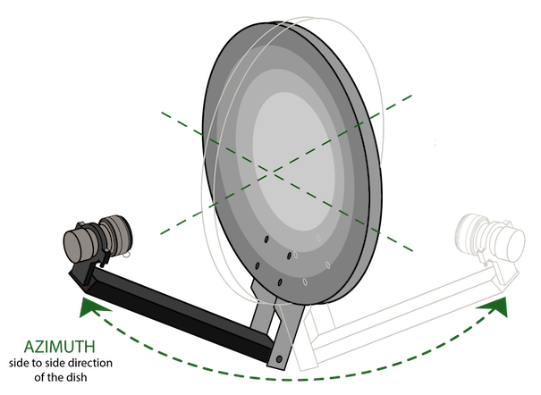
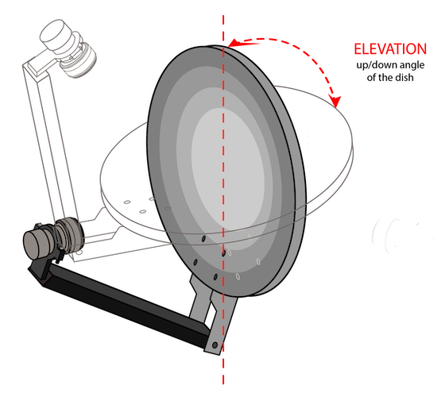
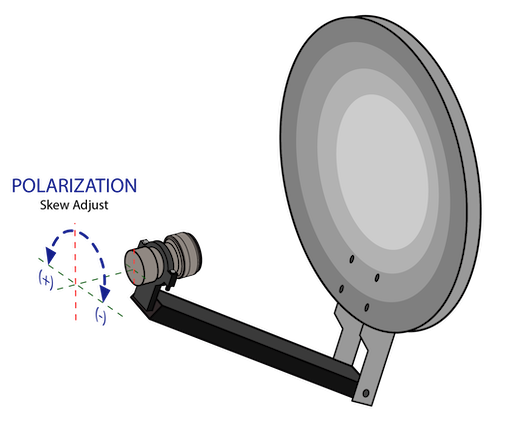

# Antenna Pointing

Aligning a satellite antenna is a precise procedure. Remember that the satellites are over 35,000 km (22,000 mi) away. A tenth of a degree of error will miss the satellite by more than 3500 km. Hence, this is likely the most time-consuming step of the process. This page provides a step-by-step guide for antenna alignment.

<!-- markdown-toc start - Don't edit this section. Run M-x markdown-toc-generate-toc again -->
**Table of Contents**

- [Mount the Antenna](#mount-the-antenna)
- [Find the Satellite and Lock the Signal](#find-the-satellite-and-lock-the-signal)
- [Optimize the SNR](#optimize-the-snr)
- [Next Steps](#next-steps)
- [Further Information](#further-information)
  - [Novra S400's User Interface](#novra-s400s-user-interface)
  - [Pointing with an SDR-based Receiver](#pointing-with-an-sdr-based-receiver)
  - [Pointing with a Satellite Finder](#pointing-with-a-satellite-finder)

<!-- markdown-toc end -->

## Mount the Antenna

First, you should obtain the pointing angles required for your specific location using our [dish alignment tool](https://blockstream.com/satellite/#satellite_network-coverage).

> NOTE: If your location is covered by two satellites and you only want to point to one of them, we recommend checking which of the two has the strongest signal in your location. For that, check the [Link Analyzer](https://satellite.blockstream.space/link-analyzer/) tool. After inputting your coordinates and obtaining the link analysis, choose the satellite with the highest expected carrier-to-noise ratio (CNR) for your chosen antenna.

After entering your address or latitude/longitude, the tool will give you the following parameters:

- **Azimuth**: the side-to-side angle of your antenna. 0 degrees refers to North, 90 degrees to East, 180 degrees to South, and 270 degrees to West.

- **Elevation**: the up and down adjustment of your antenna. The antenna aiming tool provides the number of degrees above the horizon to which your antenna must point. 0 degrees represents pointing at the horizon, and 90 degrees is pointing straight up.

- **Polarity**: determines the rotation of the LNB. It is the angle of the LNB within the LNB mounting bracket (or holder). Often this is referred to also as the LNB *polarization angle* or *LNB skew*. A positive angle means a clockwise adjustment when looking at the LNB from behind the dish and facing forwards to the satellite in the sky.

The three angles are illustrated below:

|                Azimuth                |                  Elevation                  |                     Polarity                     |
| :-----------------------------------: | :-----------------------------------------: | :----------------------------------------------: |
|  |  |  |

Next, visually inspect the direction in which your antenna must point. Use a compass or smartphone app (e.g., [Satellite Finder (Pro)](https://apps.apple.com/br/app/satellite-finder-pro/id1075788157) or [Satellite Pointer](https://play.google.com/store/apps/details?id=com.tda.satpointer)) to identify it. Ensure that there are no obstacles (like trees or buildings) between your antenna and the target area in the sky. You must have a clear line of sight to that sky area.

**IMPORTANT:** If using a compass app on a smartphone, make sure to configure the app to display **true north** instead of the **magnetic north**. The azimuth angle provided by our dish alignment tool refers to true north. Also, if using an ordinary compass or a compass-based satellite finder, make sure to convert the true azimuth obtained from the dish alignment tool into the magnetic azimuth. You can get both the true and magnetic azimuth angles using a tool such as the [Dish Pointer app](https://www.dishpointer.com).

Next, install the satellite antenna according to the directions accompanying it, or have it done professionally. If you install it yourself, proceed with the following steps:

1. Certify that the pole on which the dish is mounted is entirely level.
2. Set the elevation of the antenna to the parameter provided by the antenna aiming tool (above). Many antennas will have an elevation scale on the back of the dish that you can use to set the approximate elevation.
3. Set the LNB polarization to the parameter provided by the antenna aiming tool. This involves rotating the LNB. There is typically a polarization rotation scale on the LNB or the LNB mounting bracket.
4. Set the azimuth angle to the value obtained from the aiming tool.


> Note: if using an [offset dish antenna](https://en.wikipedia.org/wiki/Offset_dish_antenna) (the most common dish type in Ku band), make sure to subtract the dish offset angle from the nominal elevation. You can check the offset angle in the dish specifications. For example, if the nominal elevation angle at your location is 20°, and your offset reflector has an offset angle of 25°, the resulting elevation becomes -5°. In this case, it will appear that the reflector is pointing down to the ground. In reality, however, the dish will be tilted correctly to receive the low-elevation signal at the offset focal point.

At this stage, you can leave the screws that control the azimuth angle slightly loose so that you can adjust the azimuth for pointing. You can do the same for elevation and polarization. Nevertheless, the azimuth is typically easier to sweep as an initial pointing attempt.

## Find the Satellite and Lock the Signal

Assuming that the receiver is configured correctly and connected, your next step is to find the satellite. You will adjust the antenna pointing until the receiver can lock to the Blockstream Satellite signal. Please note that this is likely the most time-consuming part of the setup process, especially when doing it for the first time. As mentioned earlier, a single degree shifted on the dish represents a change of thousands of kilometers over the geosynchronous orbit.

The process will be easier with a laptop that can be watched while moving the antenna. If you cannot watch the computer, you’ll need two people: one to move the antenna and one to monitor the computer.

To start, make sure your receiver is running. Depending on your receiver type, this step involves one of the following CLI commands:

- For the TBS 5927 or 5520SE USB receivers: `blocksat-cli usb launch`.

- For the Novra S400 Standalone ([Pro Kit](https://store.blockstream.com/products/blockstream-satellite-pro-kit/)) receiver: `blocksat-cli standalone monitor` (see the [S400's instructions](s400.md#monitoring)).

- For the Sat-IP receiver ([Satellite Base Station](https://store.blockstream.com/products/blockstream-satellite-base-station/)): `blocksat-cli sat-ip`.

- For the SDR receiver: `blocksat-cli sdr`.

Alternatively, if using the GUI, you can start the receiver by clicking the "Run Receiver" button on the Receiver tab.

Next, you should monitor the receiver logs printed to the console (CLI) or shown on the GUI. Initially, while the antenna is not pointed correctly, the receiver will be unlocked. In this case, the CLI will print logs like the following:

```
2020-10-23 14:26:14  Lock = False;
```

In this case, you should try to make adjustments to the antenna pointing. For example, keep the elevation angle fixed and slowly move the antenna side to side (vary the azimuth angle). Alternatively, keep the azimuth fixed and gradually change the elevation. Every time you adjust an angle, wait a few seconds and check if the receiver has found the signal in this position. If not, try another adjustment and so on.

Once the receiver finds the signal, it will lock and the CLI/GUI will show `Lock = True`. From this point on, the application should remain locked.

You should pay special attention to the signal-to-noise ratio (SNR) parameter printed to the console (CLI) or shown on the GUI. The higher the SNR, the better. Given that the receiver is already locked, you can infer that the antenna pointing is close to the optimal position. Hence, at this point, you should experiment with gentle adjustments to the pointing angles until you can maximize the SNR. The next section discusses the target SNR levels.

> Note: the Sat-IP receiver will print a *Signal Quality* metric instead of the SNR. Again, higher is better.

Furthermore, you can check that the signal level is within acceptable limits. The LNB amplifies the signal received over satellite and feeds a reasonably high signal level into the receiver. However, the signal experiences attenuation over the coaxial cable, connectors, and adapters. The expected minimum and maximum signal levels are summarized below:

| Receiver   | Minimum Signal Level | Maximum Signal Level |
| ---------- | -------------------- | -------------------- |
| TBS 5927   | -69 dBm              | -23 dBm              |
| Novra S400 | -65 dBm              | -25 dBm              |

In the end, note that the antenna pointing procedure is entirely based on the locking indicator printed on the console. Once you find the signal and the receiver locks, the only remaining step is to [optimize the SNR](#optimize-the-snr).

This approach works for all types of receivers. However, there are helpful receiver-specific instructions for the pointing process, listed below:

- **Novra S400 Standalone receiver**: you can find various receiver status metrics within the receiver's web interface. See [the instructions](#novra-s400s-user-interface).
- **SDR receiver**: with an SDR receiver, you can visualize the signal spectrum and point the antenna more easily. See [the SDR instructions](#pointing-with-an-sdr-based-receiver).

Alternatively, you can try to point the antenna using a satellite finder. This approach is generally more helpful for the Linux USB (TBS 5927 or 5520SE), standalone (Novra S400), and Sat-IP receivers. In contrast, for SDR-based receivers, the [SDR signal visualization tools](#pointing-with-an-sdr-based-receiver) are usually better. Refer to the instructions in the [satellite finder section](#pointing-with-a-satellite-finder).

## Optimize the SNR

After the initial antenna pointing, we recommend experimenting with the pointing until you achieve your maximum SNR. The SNR level should be at least 2.23 dB. However, we recommend trying to reach an SNR of 8 dB or higher in clear sky conditions.

The SNR exceeding the minimum level determines the so-called link margin. For example, if your receiver operates at 8.2 dB, it has a 6 dB margin relative to the minimum SNR of roughly 2.2 dB. This margin means that your receiver can tolerate up to 6 dB signal attenuation in case of bad weather (such as rain).

If your receiver is already locked, try gentle adjustments around the current position and observe the SNR on the console. Stop once you find the pointing that achieves the best SNR.

If you are using a Sat-IP receiver, which does not print the SNR metric, you can optimize the Signal Quality metric instead. Try to achieve 100% quality or as close as possible.

## Next Steps

Well done! You are now ready to run the Bitcoin Satellite application receiving data via the Blockstream Satellite Network. Please refer to the [Bitcoin Satellite guide](bitcoin.md) for further instructions.

## Further Information

### Novra S400's User Interface

The Novra S400 receiver features a [web-based user interface (UI)](s400.md#s400-configuration-via-the-web-ui), which provides several receiver metrics.

At the top, the web UI has an *LNB* indicator, which indicates whether the S400 is supplying power to the LNB. Furthermore, it shows whether the S400 is locked. Assuming you have connected the LNB to input RF1, then the **RF1 Lock** indicator will be green when the unit is locked.


If the S400 is **not** locked yet, as depicted above (RF1 Lock indicator off), you should [adjust the antenna pointing](#find-the-satellite-and-lock-the-signal).

Once the S400 finally locks, the *RF1 Lock* indicator looks as follows:


You can also find signal quality and status metrics on page `Interfaces > RF1`, under *RF1 Detailed Status*. For example:


Note that the carrier-to-noise ratio (C/N) parameter relates to the SNR parameter that should be [optimized](#optimize-the-snr) during the antenna pointing.

### Pointing with an SDR-based Receiver

The SDR-based receiver offers additional visualization tools that are very helpful for antenna pointing. With this receiver, the pointing procedure consists of two steps:

1. Visualization using `gqrx`;
2. Locking using the actual receiver application.

In the first step, you should launch `gqrx` (check the gqrx [configuration instructions](sdr.md#configuration)). Then, click the start icon ("Start DSP Processing") and see if you can recognize the Blockstream Satellite signal. Ideally, you would see a flat level spanning a frequency band (in the horizontal axis) of approximately 1 MHz. Here is an example:


With the [recommended gqrx configuration](sdr.md#configuration), gqrx should be configured to the center frequency of the signal band (in this example, of 12066.9 MHz, where the red line is). However, the observed signal commonly is offset from the nominal center frequency, given that LNBs introduce frequency offset. In the above example, note the signal is around 12066.6 MHz, which means a frequency offset of -300 kHz (to the left relative to the nominal center). If gqrx's center frequency is re-configured to 12066.6 MHz, then we can see the 1 MHz band well centered, like so:


If you cannot see the signal on gqrx, you should try to make adjustments to the antenna pointing, as [described earlier](#find-the-satellite-and-lock-the-signal).

> NOTE:
>
> If you see two similar signal bands near each other, try to identify which one is more likely to be the Blockstream Satellite signal. The correct signal should span a flat level of 1 MHz, with 100 kHz of roll-off on each side. If the two signal bands are close to 1 MHz, please take note of both center frequencies and try both of them in the next steps until you get a lock.
>
> Furthermore, please note that, in some cases, there can be similar signal bands among different (but nearby) satellites. In this case, you need to adjust the pointing until you get a lock.

Once you finally find the signal in gqrx, you can proceed to run the actual SDR receiver application. As explained in the [SDR guide](sdr.md#running), you can start it via the CLI with the following command:

```
blocksat-cli sdr
```

For pointing, however, it is helpful to run it in GUI mode, as follows:

```
blocksat-cli sdr --gui
```

If you are using the GUI, you can start the receiver by clicking the "Run Receiver" button on the Receiver tab. Select the "GUI Mode" option to run the receiver with the GUI enabled, as shown below:


At this point, before proceeding, we recommend inspecting whether the gain is well configured. Check the preprocessed (iq) plot. If it looks like the one below, with strongly scattered points around the two dimensions, the gain is likely too high.


In this case, you can run with a lower gain specified on the CLI using option `-g`, like so:

```
blocksat-cli sdr -g [gain]
```

If using the GUI, set the gain field on the Receiver tab shown above.

The default gain is 40, and you can then experiment with lower values.

The IQ points should form a more compact cloud of points, such as the one below:


More information is available in [Section 9.2 of the leandvb application's user guide](http://www.pabr.org/radio/leandvb/leandvb.en.html).

Next, observe the spectrum plots. The spectrum plot shows the limits of the central band in red lines. In the example that follows, the signal presents the frequency offset of roughly -300 kHz that we already knew about from our observation on gqrx:


> NOTE: each LNB introduces a unique frequency offset, which also varies over time. The above value of -300 kHz was specific to the example setup. Your frequency offset will be different.

To correct the known offset, you can run the CLI with option `--derotate`, as follows:

```
blocksat-cli sdr -g [gain] --derotate [freq_offset]
```

where `freq_offset` represents the offset in kHz that you want to correct.

If using the GUI, you can set the frequency correction field on the Receiver tab.

With that, the preprocessed spectrum plot should be centered, as follows:


At this point, if the antenna pointing is already reasonably good, you might see the "PLS cstln" plot showing four visible clouds:

 symbols")

This plot indicates that the receiver application is locked to the Blockstream Satellite signal. Note that the more compact the four clouds of points are in this plot (around the white `+` marker), the better the signal quality.

If you cannot see the "PLS cstln" plot, it means you are not locked to the signal yet. You can troubleshoot further in debug mode by running the CLI like so (with argument `-d`):

```
blocksat-cli sdr -g [gain] --derotate [freq_offset] --gui -d
```

If you see the following logs continuously printed in the console, it means you are not locked to the signal yet:

```
DETECT
PROBE
```

When a lock is acquired, you will see the following log printed to the console:

```
LOCKED
```

After that, you should start seeing several underscores `_` printed consecutively as indicators of successful data reception. The reception indicator can be one of the three below:

- `_`: indicates a DVB-S2 frame received without errors.
- `.`: indicates an error-corrected DVB-S2 frame.
- `!`: indicates a DVB-S2 frame with remaining errors.

If you cannot lock to the signal, you should try further adjustments to the antenna. Assuming you have identified the signal on gqrx before, you can infer that the pointing is already very close. Therefore, only subtle adjustments are required at this point.

Furthermore, if you cannot find the signal on gqrx, you can search for satellite beacons instead. While the Blockstream Satellite signal is seen as a flat level spanning approximately 1 MHz, a [beacon](https://en.wikipedia.org/wiki/Radio_beacon#Space_and_satellite_radio_beacons) is a very narrow signal seen as a narrow pulse (or peak) on gqrx. All you need to do is change the frequency on gqrx to one of the beacon frequencies below:

| Satellite   | Beacons                                                                                                |
| ----------- | ------------------------------------------------------------------------------------------------------ |
| Galaxy 18   | 11701 MHz (Horizontal), 12195 MHz (Vertical)                                                           |
| Telstar 11N | 11199.25 MHz (Vertical), 11699.50 MHz (Vertical), 11198.25 MHz (Horizontal), 11698.50 MHz (Horizontal) |
| Telstar 18V | 3623 MHz (Vertical), 3625 MHz (Vertical), 4199 (Horizontal)                                            |

Make sure to select a beacon whose polarization matches your target signal polarization, which you can check using the CLI by running:

```
blocksat-cli cfg show
```

If using the GUI, go to the Receiver tab and check the parameters on the Settings sub-tab, as shown below:


Once you find the beacon signal, make gentle adjustments to the pointing until you can maximize the observed signal level. Then, change the frequency on gqrx back to the original downlink frequency of interest (also printed by the above command). You should be able to visualize the Blockstream Satellite signal now.

Ultimately, once the SDR receiver locks to the signal, you can still try to improve the SNR. Observe the SNR values printed to the console and see if you can get better values after subtle adjustments to the pointing.

In the end, once you are satisfied with the SNR (see the [target levels](#optimize-the-snr)), you can monitor several aspects of your SDR receiver. For example:

- To monitor the bitrate, run with option `--ts-monitor-bitrate`.
- To monitor the integrity of the MPEG TS packet sequence, run with option `--ts-monitor-sequence`.
- For low-level debugging information, run with option `-dd`.

### Pointing with a Satellite Finder

The antenna alignment procedure can be challenging when using a receiver other than the SDR receiver. The main limitation is that the Linux USB (TBS 5927 or 5520SE), Novra S400, and Sat-IP receivers indicate the lock status as a true or false metric. As a result, you will often see the lock status as false until you suddenly get the correct antenna direction and the lock status changes to true. In contrast, you can observe the received power spectrum in real-time with an SDR receiver and notice the satellite carrier (or beacon) even before the receiver locks. Hence, the alignment process is significantly more straightforward with an SDR receiver.

Other than using an SDR receiver, the alternative solution to obtain a gradual signal strength indicator during the antenna alignment procedure is to use a *satellite finder* device. You can plug the satellite finder into your setup and use it in conjunction with the satellite receiver. The finder can provide a signal strength indicator to allow for the optimal antenna alignment. At the same time, the receiver can confirm the pointing is correct when it properly locks to the signal.

A satellite finder usually has two connections: one to the LNB (typically labeled *satellite*) and the other to the receiver. The receiver is supposed to provide power to the finder (just like how it powers up the LNB), whereas the LNB feeds the signal of interest. Hence, the overall connection is as follows:

```
Receiver <---> Finder <---> LNB
```

Some finders also come with a dedicated power supply. And even if not, you could purchase a power supply such as the one used in the [SDR setup](hardware-components.md#specific-parts-for-the-sdr-setup). In this case, it suffices to connect the finder to the power supply instead of the receiver, as follows:

```
Power Supply <---> Finder <---> LNB
```

The latter case is handy when using a [base station receiver](sat-ip.md). You can connect the finder inline between the base station's legacy coaxial output and the power supply. Otherwise, with the other receiver types, we recommend connecting the finder inline between the receiver and LNB so that you can inspect the receiver concurrently with the finder.

Satellite finders can also differ widely in their offered capabilities. For instance, some finders only measure the signal level, such as the SF-95DR model included on the [satellite kits](https://store.blockstream.com/product-category/satellite_kits/). Meanwhile, other more advanced finder models can go a step further and demodulate DVB-S2 signals. The instructions in the sequel cover both finder categories.

#### Pointing with a Level Measurement Finder

This section applies to satellite finders capable of measuring the signal level only, such as the SF-95DR model.

To start, connect the finder as instructed earlier and enable/launch the receiver as usual to power up the finder. You should see the finder powered on with an active display.

Next, make sure the finder has an adequate attenuation and gain configuration to observe the signal level. Proceed with the following steps:

1. Press the left ATT button as many times as possible to increase the attenuation to the maximum. Also, increase the dial on the side to its max and check the signal level on the finder's display. This step aims to prepare the finder to measure the strongest possible signal. By setting the highest attenuation first, an eventual strong signal can still fall within the measurable range.

2. If the measured signal level is not 99%, it means the signal received by the finder is not as strong as anticipated. Hence, reduce the attenuation to observe weaker signals. That is, press the right ATT button until you get to a 99% level. Keep the dial on the side at its maximum throughout this process so that you can adjust the attenuation setting first.

3. Once the finder measures 99% signal level, turn the side dial down (reduce the gain) until you get a reasonably low signal level on the finder's display. For example, try achieving a level between 5% and 30%.

At this point, you should be ready to start the antenna alignment process. Make sure to keep an eye on the receiver's lock status (refer to the [lock status instructions](#find-the-satellite-and-lock-the-signal)) throughout the process and continue with the following steps:

1. Adjust the antenna roughly in the right direction based on the azimuth, elevation, and polarity angles obtained from the [Coverage Map](https://blockstream.com/satellite/#satellite_network-coverage).
2. Choose a coordinate to optimize (azimuth, elevation, or polarity) and focus on it. For example, start by optimizing the azimuth.
3. Make subtle adjustments to the chosen coordinate until you can observe an increase in the signal level measured by the finder.
4. If the level increases too much and reaches 99%, turn the side dial (gain) down slightly such that the measured signal strength comes back to a low value. If the side dial reaches its minimum and the measured level remains at 99%, it means the signal is now too strong to be measured. Increase the attenuation by pressing the left ATT button once and readjust the side dial to get the measured level back at a low value.
5. Go back to step 3 and repeat the process until you can no longer observe improvements on the measured level for the chosen coordinate.
6. Go back to step 2 and pick the next coordinate to be optimized.

If the receiver logs `Lock = True` on the console at any point, it means you are in the right direction. Otherwise, if you have optimized all coordinates using the above procedure and the receiver still logs `Lock = False`, you may have pointed to the wrong satellite. In this case, inspect the final alignment and repeat the process if necessary.

Note the main disadvantage of a level-measurement finder is that it cannot guarantee the correctness of the satellite. It only measures the signal level, so it may inadvertently guide you to a stronger signal in the sky coming from an adjacent satellite. Hence, it is vital to keep an eye on the receiver's lock status throughout the process. Only the lock status can confirm the antenna alignment is correct.

#### Pointing with a DVB-S2 Capable Finder

If you are using a satellite finder that supports DVB-S2 demodulation, you can configure it to lock to the signal. To do so, you typically need to configure the following signal parameters:

- Downlink frequency
- LNB local oscillator (LO) frequency
- Signal polarization

You can check the appropriate values by running:

```
blocksat-cli cfg show
```

If using the GUI, you can find these parameters on the Settings sub-tab of the Receiver tab.

Additionally, you will need to define:

- Symbol rate: set it to "1000 kbaud" (or "1000000 baud", or "1 Mbaud", depending on the units adopted by your finder).
- 22 kHz: enable only when using a Universal LNB and pointing to Galaxy 18 (i.e., when receiving in [Ku high band](frequency.md)). Otherwise, leave it disabled. See the [notes regarding Universal LNBs](hardware-components.md#universal-lnb).

After the configuration, the finder will typically present you with signal strength and (or) quality indicators. At this point, try aligning your antenna until you can maximize these levels.

Once you lock to the signal using the finder, check that your receiver can lock too by following the [instructions presented earlier](#find-the-satellite-and-lock-the-signal).

---

Prev: [Novra S400 Setup](s400.md) | [TBS Setup](tbs.md) | [SDR Setup](sdr.md) | [Sat-IP Setup](sat-ip.md)
