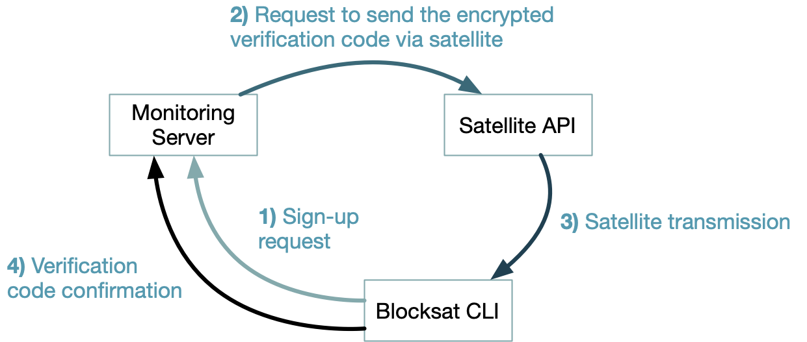

# Monitoring Server

While running your receiver, you can opt in to report your receiver performance metrics to a Blockstream-hosted server, referred to as the *satellite monitoring server*. To do so, you must explicitly enable the reporting functionality by appending option `--report` when launching the receiver. With this option, the CLI will periodically send reports over the internet. And by doing so, you will be helping us better plan and improve the satellite communications service and worldwide coverage.

The `--report` option can be appended to all supported receiver types, as follows:

TBS 5927 or 5520SE USB receiver:

```
blocksat-cli usb launch --report
```

Novra S400 standalone receiver:

```
blocksat-cli standalone monitor --report
```

SDR receiver:

```
blocksat-cli sdr --report
```

Sat-IP receiver:

```
blocksat-cli sat-ip --report
```

> NOTE: This feature was introduced in blocksat-cli version v0.4.0. Please, refer to the [upgrade instructions](quick-reference.md#cli-installation-and-upgrade) if you are running an older version.

When using this option for the first time, the CLI runs an initial registration procedure to confirm you are running a functional satellite receiver. The procedure involves a two-factor authentication mechanism over satellite, described next.

## Authentication over Satellite

The registration procedure is as illustrated below and involves the following steps:



1. The CLI (blocksat-cli) sends a registration request over the internet to the monitoring server. The request includes the user's public [GPG key used for API apps](api.md#encryption-keys).
2. The monitoring server generates a random verification code, encrypts it using the user's public key, and sends the encrypted verification code to the [Satellite API](api.md) for transmission over satellite.
3. The satellite API relays the message over the satellite links worldwide.
4. The CLI (blocksat-cli) receives the encrypted verification code, decrypts it, and confirms the verification code back to the monitoring server.

In the end, this process confirms that the user owns the private key associated with the informed public key, as this is a pre-requisite to decrypt the verification code. Furthermore, it verifies the user is running a functional satellite receiver, given that the encrypted verification code is sent exclusively over the satellite network.

## Authenticated Reports

After the initial registration, the CLI enables periodic reporting of the receiver status. While doing so, it automatically appends a [detached GPG signature](https://www.gnupg.org/gph/en/manual/x135.html) to every reported metric set. With that, the monitoring server validates the authenticity of each report.

Since version 0.4.5 of the CLI, reports can also be authenticated using a lightweight password-based mechanism as an alternative to GPG detached signatures. The CLI will create the password automatically and save it in ciphertext (encrypted) on your local configuration directory (`~/.blocksat/` by default). From this point on, it will load the password and use it every time you launch the receiver with reporting enabled.

Note that because reports are GPG-signed, or because the CLI needs to decrypt the local password (since v0.4.5), every time you launch the receiver with option `--report`, the CLI will ask for the passphrase to your local private GPG key. You can observe the underlying process by running the CLI in debug mode. For example, with the USB receiver, you can execute the following command:

```
blocksat-cli --debug usb launch --report --log-scrolling
```