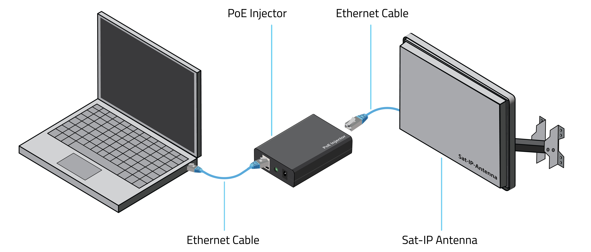

# Selfsat>IP22 Sat-IP Receiver

The Selfsat>IP22 is an all-in-one flat-panel antenna with an integrated DVB-S2 receiver and LNB. It is the basis of the Blockstream Satellite Base Station kit available on the [Blockstream Store](https://store.blockstream.com/products/blockstream-satellite-base-station/). This device receives the satellite signal and outputs IP packets to one or more [Sat-IP clients](https://en.wikipedia.org/wiki/Sat-IP) listening to it in the local network. This page explains how you can connect to the base station device to receive the Blockstream Satellite traffic.

<!-- markdown-toc start - Don't edit this section. Run M-x markdown-toc-refresh-toc -->
**Table of Contents**

- [Connections](#connections)
- [Software Requirements](#software-requirements)
- [Running](#running)
- [Next Steps](#next-steps)
- [Further Information](#further-information)
  - [Software Updates](#software-updates)
  - [Troubleshooting the Server Discovery](#troubleshooting-the-server-discovery)
  - [Direct Connection to the Base Station](#direct-connection-to-the-base-station)
  - [Running on Docker](#running-on-docker)
  - [Compilation from Source](#compilation-from-source)

<!-- markdown-toc end -->


## Connections

The integrated Sat-IP antenna-receiver can be connected as follows:



- Connect the Ethernet cable from your switch or computer's network adapter directly to the antenna's Sat>IP port.
- If your switch/adapter does not support [Power over Ethernet (PoE)](https://en.wikipedia.org/wiki/Power_over_Ethernet), insert a PoE injector in-line between the switch/adapter and the antenna's Sat-IP port. Connect the injector's PoE-enabled port to the Sat-IP antenna and the non-powered (non-PoE) port to the switch/adapter.

**IMPORTANT**: If using a PoE injector, make sure you are connecting the correct ports. Permanent damage may occur to your switch or network adapter otherwise.

## Software Requirements

To install the required applications, run:

```
blocksat-cli deps install
```

> Note: this command supports the two most recent releases of Ubuntu LTS, Fedora, CentOS, Debian, and Raspbian. In case you are using another Linux distribution or version, please refer to the [compilation instructions](#compilation-from-source).

## Running

You should now be ready to launch the Sat-IP client. You can run it by executing:

```
blocksat-cli sat-ip
```

> Note: the Sat-IP client discovers the server via [UPnP](https://en.wikipedia.org/wiki/Universal_Plug_and_Play). If your network blocks this traffic type, you can specify the Sat-IP server's IP address (i.e., the Satellite Base Station address) directly using option `-a/--addr`. Alternatively, see the [troubleshooting section](#troubleshooting-the-server-discovery).

## Next Steps

At this point, if your antenna is already correctly pointed, you should be able to start receiving data on Bitcoin Satellite. Please follow the instructions for [Bitcoin Satellite configuration](bitcoin.md). If your antenna is not aligned yet, refer to the [antenna alignment guide](antenna-pointing.md).

## Further Information

### Software Updates

To stay up-to-date with the Sat-IP client software, run the following to search for updates and install them when available:

```
blocksat-cli deps update
```
### Troubleshooting the Server Discovery

When the Sat-IP client returns the error "Could not find a Sat-IP receiver," it is possible that either the network or your host is blocking the [UPnP](https://en.wikipedia.org/wiki/Universal_Plug_and_Play) traffic used to auto-discover the base station receiver.

To troubleshoot the problem, you can start by inspecting whether the devices in the network are replying to the [SSDP](https://en.wikipedia.org/wiki/Simple_Service_Discovery_Protocol) packets sent by your host. To do so, run `tcpdump` as follows:

```
sudo tcpdump -i any port 1900
```

Typically, a reply will come from your local router, but we also need the response from the Sat-IP server (the base station device). If the base station is not replying, you can try changing the SSDP source port to 1900 and recheck the results on tcpdump:

```
blocksat-cli sat-ip --ssdp-src-port 1900
```

If you see the response coming from the base station now, but the Sat-IP client still does not connect to it, your host's firewall might be blocking the response. If you are on Ubuntu (using `ufw`), you can allow SSDP responses by running `sudo ufw allow 1900`. More specifically, it is generally preferable to configure the firewall rule with a reduced scope. For instance, you can enable only the SSDP packets coming specifically from the base station device. If you know the base station's IP address, you can do so by running:

```
sudo ufw allow from [base-station-address] to any port 1900
```

If you don't know the base station's IP address at this point, you can allow SSDP packets coming from any address in the local subnet. For instance, for a 192.168.1.1/24 subnet, run:

```
sudo ufw allow from 192.168.1.1/24 to any port 1900
```

More generally, if you are running another Linux distribution or firewall manager, make sure to allow UDP packets sent to port 1900.

### Direct Connection to the Base Station

A typical use case for the base station is connecting it to a switch or router and accessing it from hosts within the same network. However, note it is also possible to connect the host directly to the base station without intermediate switches or routers. In this case, you need to pay attention to two aspects:

1. The network interface that the host shall use when attempting to discover the Sat-IP server automatically.
2. The IP address of the chosen interface.

By default, the host will send the device discovery requests via its default network interface (for instance, a WLAN interface). Meanwhile, you may have the base station connected directly to a secondary Ethernet interface. In this case, the discovery packets would never reach the IP22. To solve the problem, specify the Ethernet interface via the `--ssdp-net-if` option when launching the Sat-IP client.

Regarding the IP address configuration, note the base station typically will not receive an IP address via [DHCP](https://en.wikipedia.org/wiki/Dynamic_Host_Configuration_Protocol) when connected directly to your host. Instead, it will fall back to a [link-local address](https://en.wikipedia.org/wiki/Link-local_address) in the 169.254.0.0/16 subnet. Hence, to communicate with the base station, you need to configure your host's Ethernet interface with an arbitrary address in the 169.254.0.0/16 subnet. For instance, assuming the Ethernet interface is named `eth0`, run:

```
ip addr add 169.254.100.50/16 dev eth0
```

Finally, run the Sat-IP client as follows while replacing `eth0` with your interface name:

```
blocksat-cli sat-ip --ssdp-net-if eth0
```

### Running on Docker

A Docker image is available for running the Sat-IP client on a container. Please refer to the instructions on the [Docker guide](docker.md).

### Compilation from Source

The Sat-IP setup relies on the [TSDuck](https://tsduck.io/) application. To build and install it from source, run:

```
git clone https://github.com/tsduck/tsduck.git
cd tsduck
build/install-prerequisites.sh
make NOTELETEXT=1 NOSRT=1 NOPCSC=1 NODTAPI=1
sudo make NOTELETEXT=1 NOSRT=1 NOPCSC=1 NODTAPI=1 install
```

> Refer to [TSDuck's documentation](https://tsduck.io/download/docs/tsduck-dev.html#chap-build) for further information.

---

Prev: [Receiver Setup](receiver.md) - Next: [Bitcoin Satellite](bitcoin.md) or [Antenna Pointing](antenna-pointing.md)
