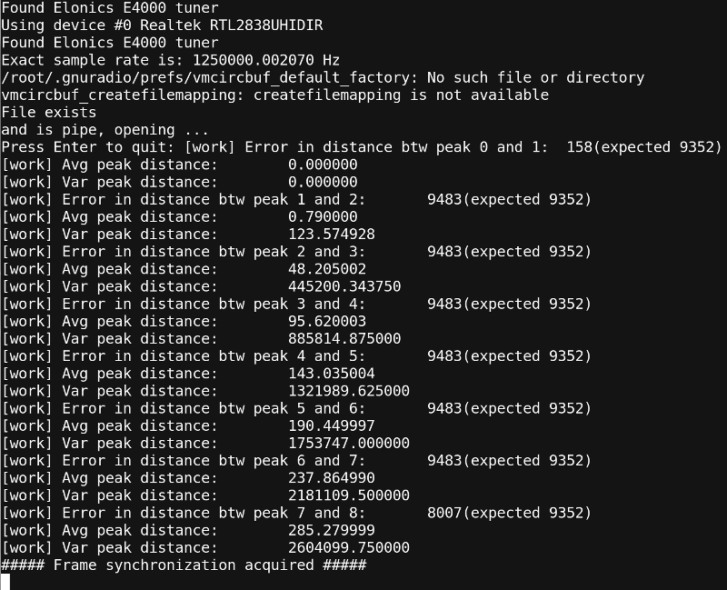
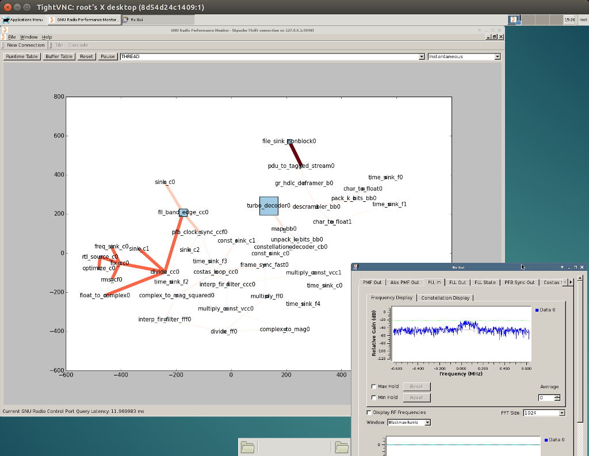

# Docker image for Blockstream Satellite

This Docker image simplify overall process. No mess with libs and packets on host machine. Everything is inside Docker container. Host machine simple requirements:

 - Any Linux distribution with Docker installed
 - RTL-SDR hardware connected 

## Build docker image
You can skip this step and go to 'run' step. In this case binary image will be downloaded from the Docker hub cloud. If you decided to build Docker image by yourself then run following command

    docker build -t aospan/bitcoin-satellite -f Dockerfile .

## Run

    mkdir ~/tmp-async
    docker run --privileged \
      -v ~/tmp-async:/tmp \
      -e FREQ=1429000000 \
      -e GAIN=40 \
      --name sat --rm -it \
      aospan/bitcoin-satellite

change FREQ and GAIN accordingly. Please check [this](https://github.com/Blockstream/satellite) manual for details. You should see following screen if everything is works fine

Received blocks will be available on host machine in `~/tmp-async/async_rx` pipe. Now you can run Bitcoin Fibre on host machine to further process of received blocks:

    bitcoind -fecreaddevice=~/tmp-async/async_rx

After this point your blockchain db should be in sync. New blocks will arrive from satellite.

# GNU Radio performance profiling with Apache Thrift
## Build
You can skip this step if you don't want to build image by yourself. Just skip to 'run' step.

    docker build -t aospan/bitcoin-satellite-profile \
      -f Dockerfile-gnuradio_profile .

## Run

    mkdir ~/tmp-async
    docker run --privileged \
	  -v ~/tmp-async:/tmp \
      -p 9090:9090 \
      -p 5901:5901 \
      -e FREQ=1429000000 \
      -e GAIN=40 \
      -e VNCPASSWORD=secret \
      -e GUI=1 \
      --name sat --rm -it \
      aospan/bitcoin-satellite-profile
  

change FREQ, GAIN and VNCPASSWORD accordingly. This docker image will open port 5901 for incoming VNC connections. Connect to this vncserver using vncviewer (available for all platforms including mobile phones).

    vncviewer 192.168.1.121:1

change ip-address (192.168.1.121) accordingly. You should see following screen with `gr-perf-monitorx` and `rx_gui.py` running.

In `gr-perf-monitorx` the nodes are blue boxes where the size of the box is proportional to the work time and the color depth and line width are proportional to the output buffer fullness.
